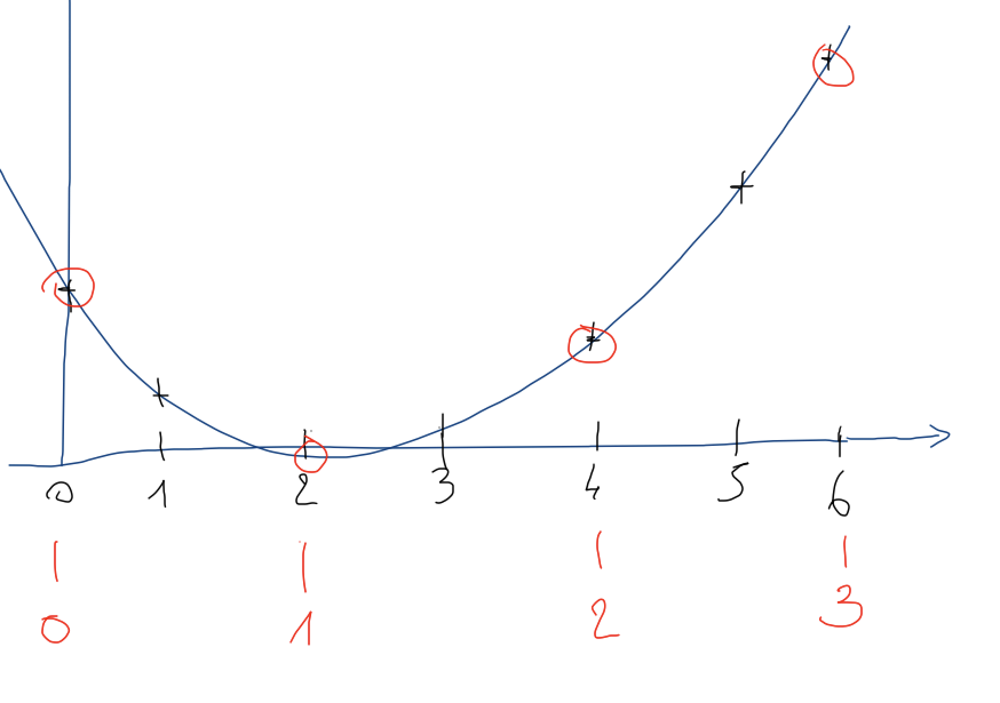
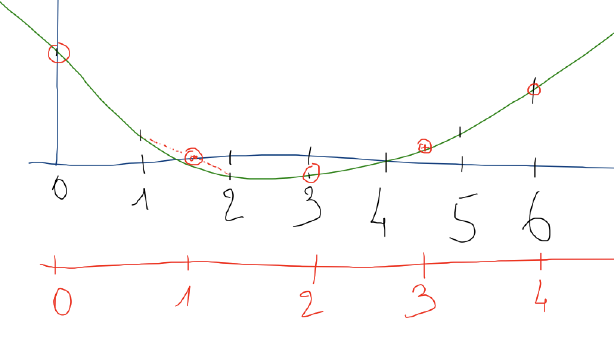

# TP - Un peu de musique

## Avertissement initial

Pour le confort de tous, veuillez vous assurer, avant de commencer, que le volume de vos haut-parleurs est réglé au minimum audible pour vous.

## Prérequis et imports

Nous commençons par importer les bibliothèques nécessaires.

```{code-cell} ipython3
# Pour des graphiques interactifs (permet de zoomer, etc.)
# Nécessite d'installer ipympl avec `pip install ipympl`
# %matplotlib ipympl

import numpy as np
import matplotlib.pyplot as plt
# Pour jouer les sons que nous allons produire
from IPython.display import Audio
from scipy.io import wavfile
```

## 1. Nature du son et échantillonnage

### 1.1. Principe fondamental
Un son est une oscillation de la pression de l'air, que l'on capture via la position d'une membrane (par exemple, celle d'un microphone) au cours du temps. Cette position oscille de façon pseudo-périodique autour d'une position d'équilibre.

La **fréquence** de cette oscillation détermine la **hauteur** du son perçu. Par exemple, la fréquence de 440 Hz correspond à la note LA.

### 1.2. L'échantillonnage
Pour numériser un signal sonore, on capture la position de la membrane **à intervalles de temps réguliers**. C'est le processus d'**échantillonnage**. Le résultat est une suite de valeurs numériques.

Les fréquences audibles pour l'humain vont environ de 20 Hz à 20 kHz. Pour capturer ces fréquences sans perte d'information, on utilise une fréquence d'échantillonnage standard de 44.1 kHz (44 100 échantillons par seconde), héritée des CD audio.

```{code-cell} ipython3
RATE = 44_100
LA = 440
DO = 523.25
```

## 2. Synthèse d'un son pur

### 2.1. Génération d'une sinusoïde
L'objectif est de produire un son correspondant à un LA (440 Hz) d'une seconde.

**Énoncé :**
1.  Combien d'échantillons doit contenir notre tableau pour une durée de 1 seconde ?
2.  Quelle est l'équation mathématique qui donne la position de la membrane en fonction du temps $t$ sur l'intervalle $[0, 1]$ pour une fréquence $\phi$ ?
3.  Construiser ce tableau grace à numpy et utilisé matplotlib pour afficher les 50 premières ms de cette courbe. Utiliser ensuite les fonctions Audio et display pour écouter votre premier son.
4.  Généraliser votre code dans une fonction display_signal  


<details>
<summary><b>Indice 1 : Nombre d'échantillons</b></summary>
Le nombre d'échantillons est le produit de la durée par la fréquence d'échantillonnage.
</details>

<details>
<summary><b>Indice 2 : Équation temporelle</b></summary>

La fonction est : $\ f(t) = \sin(2\pi\phi t)\ $ avec $\ t  \subset [0, 1] \ $

</details>

<details>
<summary><b>Indice 3 : Généraliser </b></summary>

def display_signal(signal, rate=RATE, title="Signal", width=1):

</details>


### 2.2. Généralisation : la fonction `sine()`
Nous allons maintenant créer une fonction plus générique pour produire une sinusoïde.

**Consigne :** Écrire une fonction `sine(freq, duration=1, amplitude=1.)` qui produit un son sinusoïdal pour la fréquence `freq` et la durée `duration` (en secondes).

### 2.3. Pour aller plus loin : glissando (Effet "note qui monte")
**Objectif :** Produire un son dont la fréquence varie de manière linéaire (croit ou décroit) avec le temps.

**Consigne :** Écrire une fonction sine_linear(freq1, freq2, duration) qui génère un son sinusoïdal dont la fréquence passe progressivement de freq1 à freq2 pendant duration secondes.

<details>
<summary><b>Indice : Variation linéaire</b></summary>
Pour chaque échantillon, la fréquence instantanée doit varier linéairement. Vous pouvez créer un vecteur de fréquences qui va de `freq1` à `freq2` sur toute la durée du son, puis calculer la phase par intégration (ne pas utiliser de boucle for). La section Aggregate Functions de la Cheat Sheet numpy vous sera utile. 
</details>

## 3. Gestion du volume et de la dynamique

### 3.1. Création d'un crescendo
Nous souhaitons maintenant que le volume (l'amplitude) du son varie. L'objectif est de produire un crescendo, c'est-à-dire une augmentation linéaire du volume sur la durée du son.

**Énoncé :**
1.  Proposez une méthode pour moduler l'amplitude de votre sinusoïde.

<details>
<summary><b>Indice : Modulation d'amplitude</b></summary>
Il suffit de multiplier le signal par un vecteur d'amplitude qui varie de 0 à 1 (ou de 1 à 0) linéairement sur la durée du son.
</details>

2.  Écrivez une fonction `crescendo_sine(freq, duration)`.

3.  Modifiez la fonction pour qu'elle puisse aussi produire un decrescendo grâce à un paramètre `increase=True/False`.

4.  *(Pour les plus avancés)* Proposez une approche plus générique pour appliquer un crescendo à n'importe quel son, et pas seulement à une sinusoïde.

## 4. Concaténation de sons

Nous savons maintenant produire des notes séparées. L'objectif est de les enchaîner pour créer une mélodie.

**Énoncé :** Produire une succession de deux notes : un LA (440 Hz) puis un DO (523.25 Hz), chacune d'une durée de 1 seconde.

<details>
<summary><b>Indice : Concaténation</b></summary>
Utilisez `np.concatenate()` pour joindre les deux tableaux.
</details>

## 5. Formats de données audio

### 5.1. Flottants vs. Entiers
Jusqu'à présent, nos échantillons sont des nombres **flottants** entre -1 et 1. Pour le stockage sur fichier (par exemple en .wav), il est plus standard d'utiliser des **entiers signés sur 16 bits** (`numpy.int16`).

### 5.2. Représentation des entiers signés
Un encodage sur `int16` peut représenter des valeurs de -32768 à 32767.

```{attention}
Si vous tentez de convertir une valeur hors de cet intervalle en `int16`, vous obtiendrez une erreur de dépassement (`OverflowError`).
```

### 5.3. Mise à l'échelle
**Exercice :** Écrire une fonction `float_to_int16(as_float)` qui convertit un tableau de flottants dans [-1, 1] en un tableau d'entiers signés sur 16 bits (`int16`).

<details>
<summary><b>Indice : Mise à l'échelle</b></summary>
La valeur maximale codable (1.0) doit correspondre à la valeur maximale de l'entier signé (32767). N'oubliez pas de convertir le type du tableau.
</details>

## 6. Les fréquences des notes de la gamme

### 6.1. Introduction : Intervalles musicaux
La gamme chromatique (toutes les notes d'un piano) est composée de 12 notes :
*do* ・ *do#* ・ *ré* ・ *ré#* ・ *mi* ・ *fa* ・ *fa#* ・ *sol* ・ *sol#* ・ *la* ・ *la#* ・ *si*.

L'oreille humaine est sensible aux **intervalles**, c'est-à-dire aux rapports entre les fréquences. Par exemple, une **octave** correspond à un rapport de fréquence de 2 (un *do* suivi d'un *do'* plus aigu).

### 6.2. Calcul des rapports
Un **demi-ton** est l'intervalle entre deux notes consécutives de la gamme. Il correspond toujours à un rapport de fréquences constant, noté $\alpha$.

Ainsi, pour passer d'un *do* à son octave supérieure (12 demi-tons plus tard), on a :
$\alpha^{12} = 2$.

D'où $\alpha = 2^{1/12}$.

**Exercice 1 :** Créer un tableau `ratios` contenant les 13 rapports (de *do* à *do'* inclus). `ratios[0]` doit valoir 1 et `ratios[12]` doit valoir 2.

<details>
<summary><b>Indice</b></summary>
Chercher une astuce dans la section "les tableaux" de votre cours sur numpy
</details>

**Exercice 2 :** Écrire une fonction `freq_from_name(name)` qui, à partir du nom d'une note (parmi les 12 notes de la gamme), retourne sa fréquence en sachant que le LA fait 440 Hz.

<details>
<summary><b>Indice : Dictionnaire ou index</b></summary>
Utilisez un dictionnaire pour associer chaque nom de note à son index dans la gamme, puis calculez la fréquence avec `freq = 440 * (2**(1/12))**(index - index_la)`.
</details>

**Exercice 3 :** Vérifier la fonction `freq_from_name('la') == 440`.
<details>
<summary><b>Indice : Si c'est False </b></summary>
Regarder ce que fait la fontion np.isclose.
</details>

## 7. Les accords : Superposition de sons

Un accord est un ensemble de notes jouées simultanément. Comment réaliser cette superposition avec nos tableaux numériques ?

<details>
<summary><b>Indice : Somme des signaux</b></summary>
Il suffit d'additionner les tableaux de chaque note. Attention à bien les avoir de la même longueur.
</details>

## 8. Sauvegarde et chargement de fichiers `.wav`

La bibliothèque `scipy.io` permet d'écrire et de lire des fichiers `.wav`.

```{code-cell} ipython3
from scipy.io import wavfile
```

**Exercice :**
1.  Sauvegarder un son (par exemple `la_do`) dans un fichier `sample.wav`.
2.  Relire ce fichier dans une variable `restored`.
3.  Vérifier que le son restitué est conforme à l'original.

<details>
<summary><b>Indice : Conversion</b></summary>
Pour sauvegarder, votre signal doit être au format `int16`. Utilisez `wavfile.write()`.
</details>

## 9. Analyse d'un son réel

Nous allons utiliser le fichier `media/sounds-cello.wav`.

**Exercice :**
1.  Lire le fichier et stocker le signal dans une variable `data`.
2.  Écouter le son.
3.  Afficher le taux d'échantillonnage (`samplerate`) du fichier.
4.  Afficher le nombre total d'échantillons.
5.  Afficher la durée totale du morceau en secondes.
6.  Afficher le signal (la position de la membrane en fonction du temps) avec `plt.plot()`.

## 10. Ajout d'un effet d'écho

L'objectif est d'ajouter une ou plusieurs répétitions atténuées du signal original.

```{code-cell} ipython3
# Paramètres pour l'écho
delay = 2  # en secondes
main_ratio, delayed_ratio = 0.7, 0.3
```

**Exercice v1 :** Produire un son avec écho d'une durée égale au son original.
1.  Convertir `delay` en nombre d'échantillons (`offset`).
2.  Créer le signal avec écho en ne gardant que la durée originale (on "coupe" l'écho qui dépasse).
3.  Visualiser le résultat.

<details>
<summary><b>Indice : Décalage</b></summary>
Créez un tableau de zéros de la taille du signal original. Placez une version atténuée du signal original dans ce tableau, mais décalée de `offset` échantillons.
</details>

**Exercice v2 :** Produire un son avec écho sur une durée plus longue (durée originale + retard).

## 11. Transposition

### 11.1. Transposer d'une octave

On a vu qu'une octave correspond à une fréquence deux fois plus élevée.

Partant par exemple de `data`, comment produire un son une octave au-dessus ? (on s'astreint à ne pas modifier le samplerate)

<details>
<summary><b>Indice</b></summary>
Pour élever d'une octave, il suffit d'ignorer un échantillon sur deux.

Pourquoi ? De cette façon on va artificiellement :
- diminuer la durée par 2 (2 fois moins d'échantillons, toujours à la même fréquence d'échantillonnage de 44 100 Hz)
- et du coup multiplier par 2 la fréquence des sons perçus
</details>



**Exercice :** fabriquer un son qui soit similaire à celui dans `data`, mais une octave au-dessus.


### 11.2. Transposer d'une quinte

Pour transposer d'une quinte, il faut multiplier la fréquence par 3/2 ; on peut utiliser une approche voisine :



sauf que cette fois il faut interpoler :

```
data         data3
0    0       0
1    1+2/2   1
2    --
3    3       2
4    4+5/2   3
5    --
...
```

**Exercice :**
1. Créer un tableau `data3` dont la taille est 2/3 de celle de `data`.
2. Remplir dans `data3` les données de rang pair, qui correspondent aux multiples de 3 dans le tableau de départ.
3. Remplir dans `data3` les données de rang impair, en implémentant l'interpolation.

**Remarque :** nos `data` sont en `int16`, on s'efforce de rester dans ce format.

<details>
<summary><b>Indice</b></summary>
Les indices pairs de `data3` viennent de `data[0::3]`. Les indices impairs viennent de la moyenne entre deux échantillons voisins de `data`, également espacés de 3.
</details>


### 11.3. La fraction la plus proche (avancés - sans exercice)

On peut s'amuser à calculer, pour chaque note, la fraction la plus proche - si on se restreint à des rationnels avec un dénominateur "petit".

Pour ça on se fixe par exemple N=7 et pour chaque note x, on veut minimiser abs(x-r) pour r étant dans l'espace
$$r\in\{1 + p/q, q<=N, 0<=p<=q\}$$

Si on voulait faire ça en Python pur, on pourrait écrire quelque chose comme :

```python
from fractions import Fraction

N = 7

# tous les rationnels concernés dans [1, 2[
rationals = {1 + Fraction(p, q) for q in range(1, N + 1) for p in range(q + 1)}
```

```python
# la version la plus rapide à écrire
def closest1(note):
    return min(abs((note - rational) / rational) for rational in rationals)
```

```python
# mais le souci c'est qu'on a perdu de l'information
tierce, quinte = ratios[4], ratios[7]
closest1(quinte)
```

```python
# du coup ça se complique un peu

def closest2(note):
    minimum = np.inf
    result = None
    for rational in rationals:
        if abs(note - rational) < minimum:
            minimum = abs(note - rational) / note
            result = rational
    return result, minimum
```

```python
closest2(quinte)
```

```python
# encore une autre version

def closest(note):
    """
    on retourne le rationnel le plus proche
    avec l'erreur relative que ça représente

    sous la forme d'un tuple
    (rationnel, erreur relative)
    """
    # on va trier une liste de tuples (rational, relative_error)
    # c'est sous-optimal d'un point de vue algorithmique
    # car on n'a pas vraiment besoin de trier toute la liste
    # dans ces ordres de grandeur ça n'a pas bcp d'importance
    # par contre ça donne un code un peu plus intéressant
    candidates = [(rational, abs(note - rational) / note) for rational in rationals]
    return sorted(candidates, key=lambda couple: couple[1])[0]
```

```python
closest(quinte)
```

#### Les accords harmonieux

Si on ne garde que les notes qui sont très proches - avec une erreur relative de moins de 0.5% - on trouve les intervalles do-fa et do-sol.

## 12. Création libre d'une musique de 1 minute

### 12.1. Objectif
Utiliser les outils développés dans ce TP **en collaboration avec une IA** pour créer une **musique originale de 1 minute**.
Vous pouvez :
- Demander des idées à l'IA (mélodies, accords, structure).
- Implémenter ces idées en Python avec les fonctions du TP.
- Expérimenter avec les effets (crescendo, écho)

